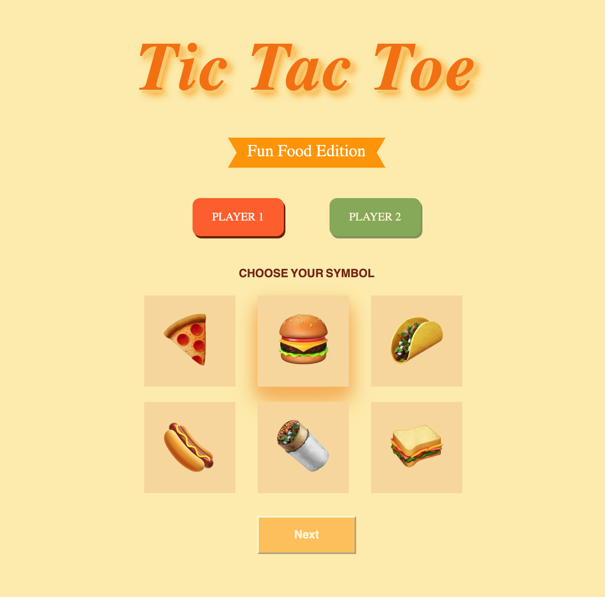
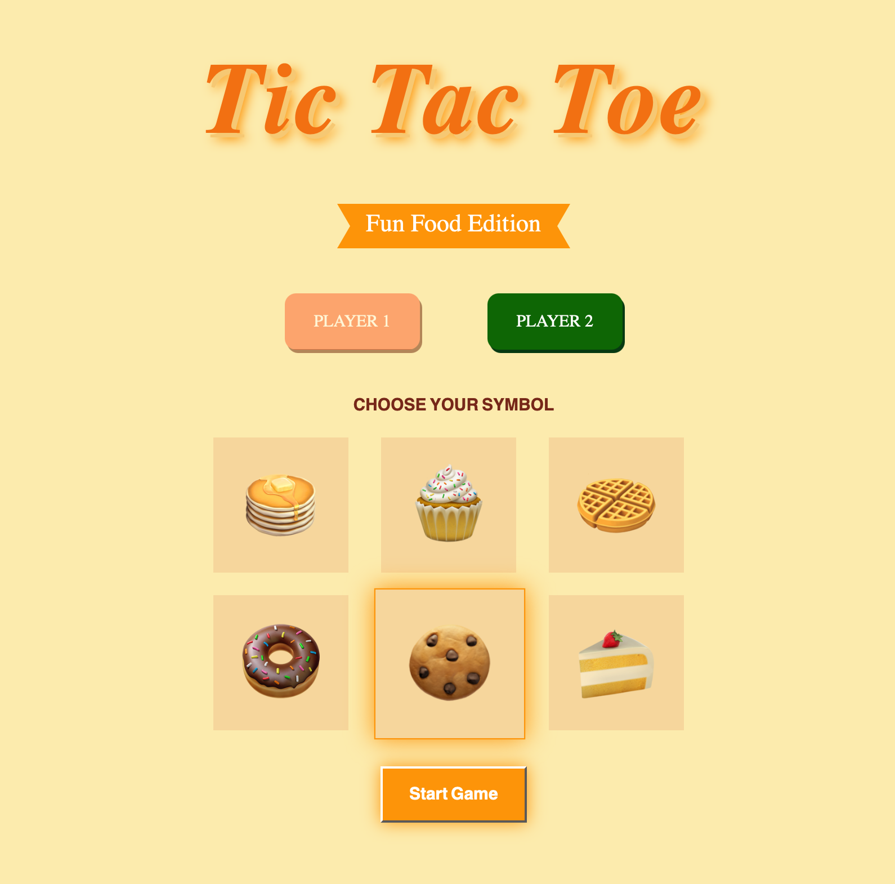
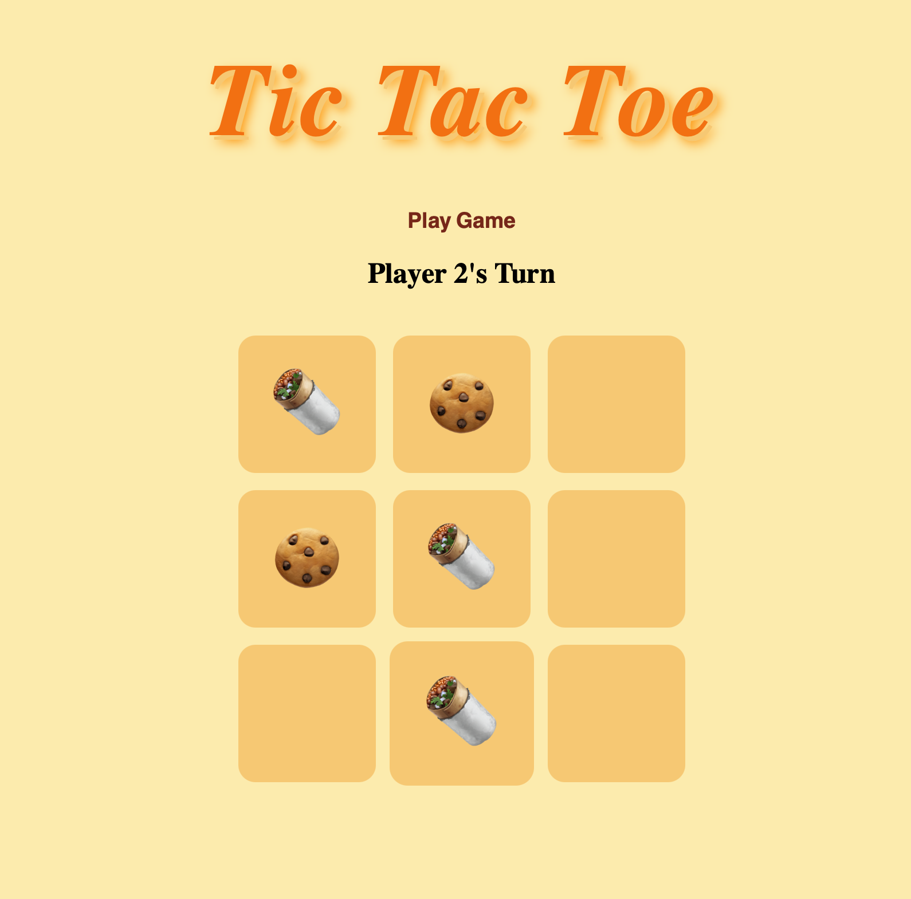
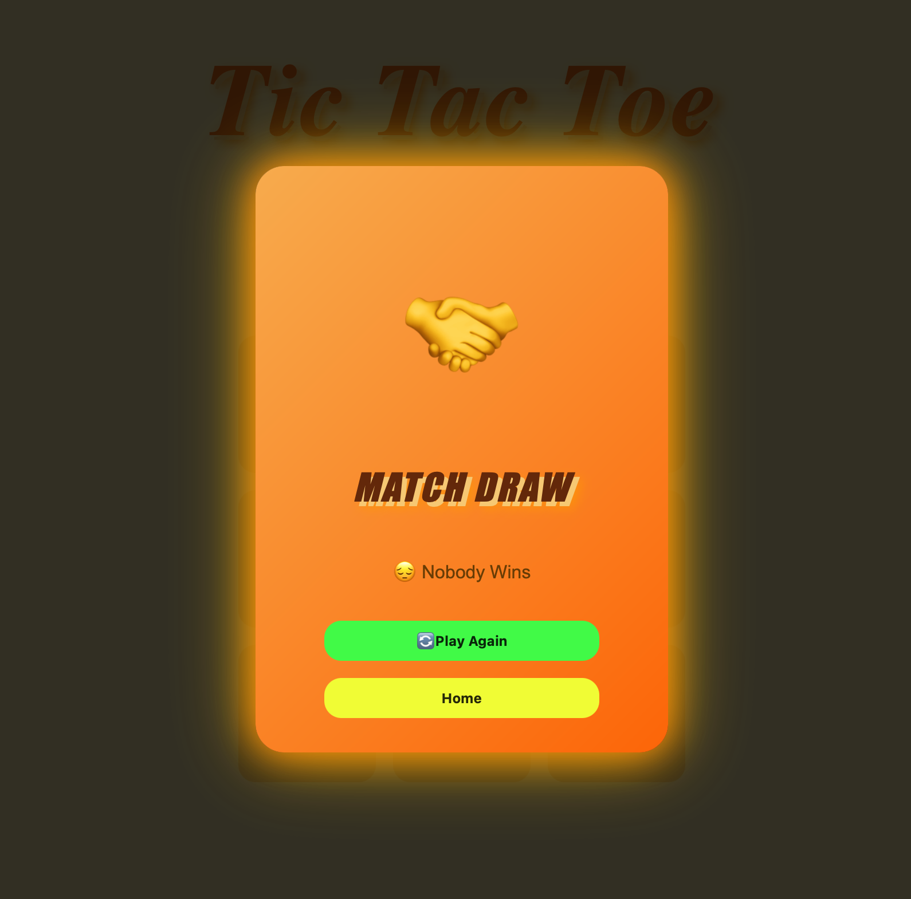

# Tic Tac Toe - Food Edition

A fun and interactive Tic Tac Toe game built using HTML, CSS, and JavaScript.

## Features

- Food-themed Tic Tac Toe
- Player 1 food selection
- Player 2 food selection
- Hover effects and animations
- Selected food highlighting
- Dynamic game board
- Winner popup
- Match Draw popup
- Play Again button
- Home button

## Technologies Used

- HTML5
- CSS3
- JavaScript

## Screenshots

### Home Screen


### Food Selection Screen


### Game Board


### Winner Popup


## Live Demo

[GitHub Pages Link](https://prachi-co.github.io/Tic-Tac-Toe/))

## Project Structure
```text
Tic-Tac-Toe/
│
├── index.html
├── Play.html
├── style.css
├── HomePage.js
├── Play.js
└── README.md
```

## Author

Prachi Shah

B.Tech CSE (AI & ML)

Frontend Developer | UI/UX Designer
